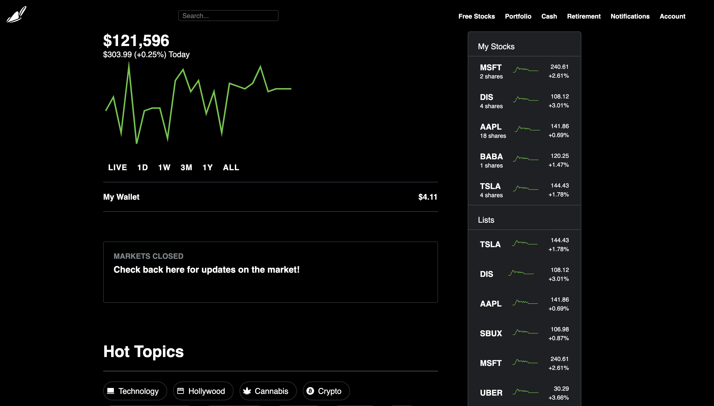

# Stoxy: Your Go-To Investing App!

Built using React and Firebase, Stoxy utilizes the Finnhub API to constantly update with current prices of stocks as well as their opening price, closing price and the percentage by which they went up or down. On top of that, you can click from the selection of stocks on the right to add to your stocks. Or, if you want to sell, simply click on one you already own! On the left you will also see a chart that shows your "earnings" as well as a total amount you've lost or earned on top. 

Wondering what's big in the world that can affect your favorite company's stock soon? Look at the hot topics on the bottom of the page to see what's trending in the world today! 

## Built Using:

  

&nbsp;

## DISCLAIMER:

Stoxy is not a real, functioning investment app. Stoxy will never ask you for payment of any kind and does not have the ability to give you or gift you shares of any company of any kind. This is a front-end project only, meaning your personal information is not stored or saved. 

## Did you like the app?

Then shoot me a message on LinkedIn and tell me what you thought of it!

  

